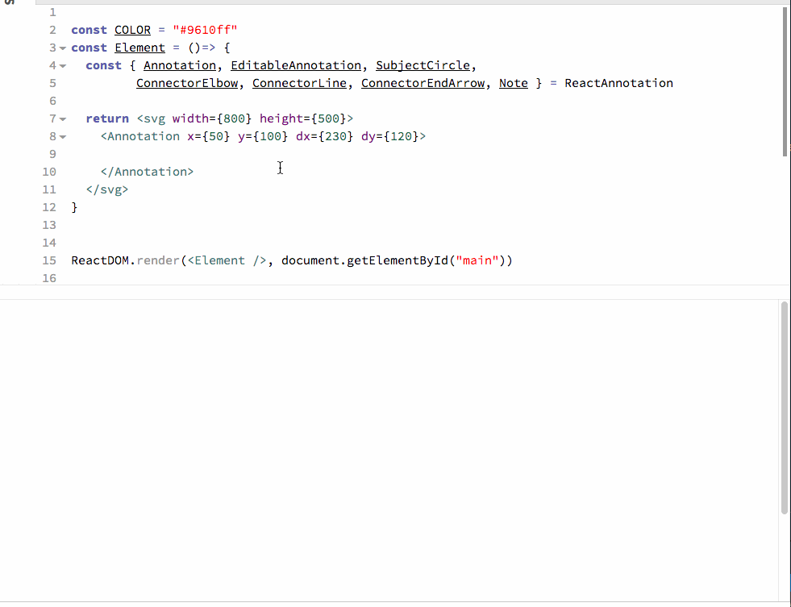

# react-annotation

Full documentation: [http://react-annotation.susielu.com](http://react-annotation.susielu.com)



## Setup

### Using NPM

You can add react-annotation as a node module by running

```bash
npm i react-annotation -S
```

If you're new to using React, I suggest using [create-react-app](https://github.com/facebookincubator/create-react-app) to start your project

## Local Setup and Build

This project uses [yarn](https://yarnpkg.com/lang/en/docs/install/#mac-stable), make sure that is set up prior to installing and building. To test out the library and run the docs locally, clone the repo and then run:

```js
yarn install
```

Then run the start command to have a process watch for changes and build the docs site:

```js
yarn start
```

If you want to make a production build of the docs run:

```js
yarn build
//this includes the yarn run prebuild command below
```

If you want to make a production build of just the components and the bundle.js that can be used as a codepen import run:

```js
yarn prebuild
```

## Feedback

I would love to hear from you about any additional features that would be useful, please say hi on twitter [@DataToViz](https://www.twitter.com/DataToViz).

## Prior art

- [Andrew Mollica](https://bl.ocks.org/armollica/67f3cf7bf08a02d95d48dc9f0c91f26c), [d3-ring-note](https://github.com/armollica/d3-ring-note) D3 plugin for placing circle and text annotation, and [HTML Annotation](http://bl.ocks.org/armollica/78894d0b3cbd46d8d8d19d135c6ca34d)

- [Scatterplot with d3-annotate](https://bl.ocks.org/cmpolis/f9805a98b8a455aaccb56e5ee59964f8), by Chris Polis, example using [d3-annotate](https://github.com/cmpolis/d3-annotate)

- [Rickshaw](http://code.shutterstock.com/rickshaw/) has an annotation tool

- [Benn Stancil](https://modeanalytics.com/benn/reports/21ebfb6b6138) has an annotation example for a line chart

- [Adam Pearce](http://blockbuilder.org/1wheel/68073eeba4d19c454a8c25fcd6e9e68a) has arc-arrows and [swoopy drag](http://1wheel.github.io/swoopy-drag/)

- [Micah Stubbs](http://bl.ocks.org/micahstubbs/fa129089b7989975e96b166077f74de4#annotations.json) has a nice VR chart based on swoopy drag

- [Scott Logic](http://blog.scottlogic.com/2014/08/26/two-line-components-for-d3-charts.html) evokes “line annotation” in a graph (different concept).

- [Seven Features You’ll Want In Your Next Charting Tool](http://vis4.net/blog/posts/seven-features-youll-wantin-your-next-charting-tool/) shows how the NYT does annotations

- [John Burn-Murdoch](https://bl.ocks.org/johnburnmurdoch/bcdb4e85c7523a2b0e64961f0d227154) example with adding/removing and repositioning annotations
